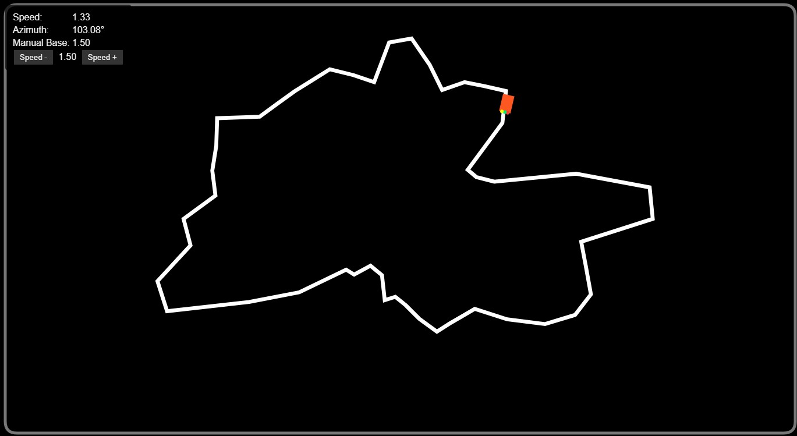

# Line-Following-Robot
Line following robot simulation

This repository contains different versions of the LFR project. Below are links to the HTML files along with their corresponding images.

## Available Versions

### [LFR v1](lfr_v1.html)

### [LFR v2](lfr_v2.html)

### [LFR v3](lfr_v3.html)

### [LFR v4](lfr_v4.html)

### [LFR v5](lfr_v5.html)

### [LFR v6](lfr_v6.html)

### [LFR v7](lfr_v7.html)

### [LFR v8](lfr_v8.html)

### [LFR v9](lfr_v9.html)

